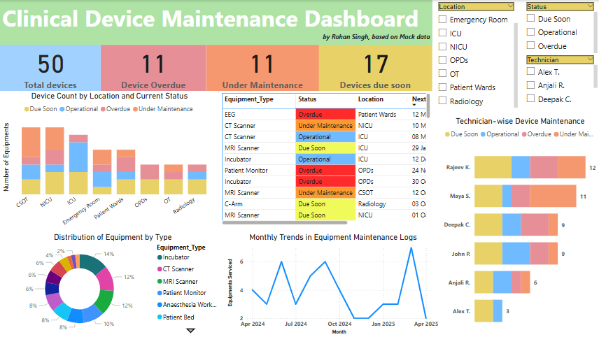

## Table of Contents
- [Project Overview](#project-overview)
- [Dashboard Preview](#️dashboard-preview)
- [Files in this Repository](#files-in-this-repository)
- [Insights](#insights)
- [Author](#Author)

# Clinical Device Lifecycle & Risk Management Platform

🧠 A project built using Power BI + Figma based on clinical workflows observed during academic clinical exposure at CMC Vellore and SCTIMST, simulating a real-world hospital scenario for monitoring and managing medical equipment risks and maintenance.

## 📌 Problem Statement
Manual logs and delayed preventive maintenance workflows create safety and compliance gaps in large Indian government hospitals.

## 🎯 Objectives
- Track lifecycle and performance of medical devices
- Prioritize preventive maintenance
- Automate ISO 14971 risk scoring logic
- Deliver real-time insights via Power BI dashboards

## 🧰 Tools Used
| Task                    | Tool          |
|-------------------------|---------------|
| Wireframes              | Figma         |
| Data Simulation         | Excel         |
| Dashboarding            | Power BI      |
| Planning & Docs         | PPT           |

## 👥 Stakeholders
- Biomedical Engineer (Operator)
- Nurse Supervisor (Reporter)
- Pharmacist (Cold Chain Owner)
- Hospital Admin (Compliance & Strategy)

## 📊 Key Dashboard Visuals
- KPI Cards (Overdue, Due Soon, Operational)
- Department-wise Equipment Status
- Technician Workload
- Equipment Type Breakdown
- Monthly Service Trends
## 🖥️ Dashboard Preview

## 📈 Insights Enabled
- High-risk zones (e.g. NICU, OT)
- Technician overload patterns
- Non-compliance with service cycles
- Readiness for NABH/ISO audit

  ## 📂 Files in this Repository

- 📊 [Dashboard Power BI File (.pbix)](./Device Analytics project dashboard.pbix)
- 📄 [Mock Hospital Dataset (.csv)](./Mock_Clinical_Maintenance_Data.csv)
- 🖼️ [Dashboard Screenshot](./Dashboard.png))
- 📑 [Final Slide Deck (PPT)](./Healthcare_analytics_project.pdf)

## 📂 Files Included
- `/Data/` - Mock hospital data (CSV)
- `/PowerBI/` - .pbix dashboard file
- `/Docs/` - Slide deck/report
- `/Screenshots/` - Dashboard preview

## 📥 Author
**Rohan Singh**  
  
📧 rohans.dmvt@gmail.com  
🔗 [LinkedIn](https://www.linkedin.com/in/rohan-singh-688a7a1b8/)  

